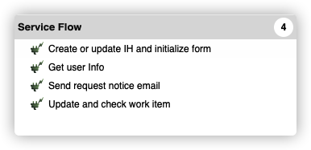

# SCIS toolkit

This projects contains the Supply Chain Intelligence Suite (SCIS) toolkit. This toolkit contains a library of workflow components that are designed to be shared across multiple workflows within an organization. The toolkit components help to facilitate common and expected workflow routines such as updating the work item and actions taken associated with a given process instance. In particular, the toolkit exposes service flows for interfacing with Sterling InfoHub and [Sendgrid email delivery](https://cloud.ibm.com/catalog/infrastructure/email-delivery). Simply import this toolkit within your workflow projects to begin utilizing these shared capabilities. For more information on toolkits within IBM Business Automation Workflow, you may consult [the BAW documentation for creating toolkits](https://www.ibm.com/docs/en/baw/20.x?topic=mp-creating-changing-deleting-toolkit-dependency-in-designer-view).


## Importing the toolkit
You can import SCIS toolkit into **IBM® Business Automation Workflow** libraries through the Workflow Center console.

Please download the latest SCIS toolkit(.twx) from [Github release page](https://github.ibm.com/SC-Shared-Services/ai-workflow-toolkit/releases) and follow the [instructions on how to import a toolkit into BAW](https://www.ibm.com/docs/en/baw/20.x?topic=projects-importing-exporting) to import the SCIS toolkit. Please note once the toolkit is imported, you should be able to view the service flows described within the README inside of your respective workflow.




After that you will need to set up Environment variables follow by next section.

Please refer this [instruction](https://www.ibm.com/docs/en/baw/20.x?topic=mp-creating-changing-deleting-toolkit-dependency-in-designer-view) to manage SCIS toolkit as dependency in your process application.


## Configuring the toolkit
Users need to follow the [instruction](https://www.ibm.com/docs/en/baw/19.x?topic=applications-setting-environment-variables) to set up Environment variables to make toolkit fully works. Here's the variables list.

| Environment name | Description |
|:---|:---|
| EMAIL_ENDPOINT | The SMTP host to connect to  |
| EMAIL_USERNAME | The user name registered for email service  |
| EMAIL_PASSWORD | The password for email service |
| GQL_URL | Fully specified URL points to InfoHub query API
| WORKITEM_URL | Fully specified URL points to InfoHub workitem API  |
| ACTIONTAKEN_URL | Fully specified URL points to InfoHub actionTaken API  |
| PROCESS\_PORTAL\_TASK_URL | Partially specified URL points to given task in Process Portal |
| INFOHUB\_CLIENT\_ID_\<*clientId*> | Sterling saascore platform client Id. Please attach clientId to the end of string **`INFOHUB_CLIENT_ID_`** as the environment name. <br/>e.g. INFOHUB\_CLIENT\_ID\_22909_fdf\_768876<br/>** *clientId* is InfoHub client ID associated with the given organization. |
| INFOHUB\_CLIENT\_SECRET_\<*clientId*> | Sterling saascore platform client secret. Please attach clientId to the end of string **`INFOHUB_CLIENT_SECRET_`** as the environment name. <br/>e.g. INFOHUB\_CLIENT\_ID\_22909_fdf\_768876 <br/>** *clientId* is InfoHub client ID associated with the given organization. |
| STERLING_FUNCTIONAL_USER | IBM identity representing workflow functional user

## Java modules in SCIS toolkit

The desired function can be realized in the Java library, and the Java library can be added to the toolkit and added as external services, in order to make it a component of the toolkit and be able to be invoked by the app.

Here're the external services from SCIS toolkit library.


	- Data Query service
	- MailPlus service
	- Work item client service


## External services and service flows
There're a series of external services in SCIS toolkit. Please refer below to browse the details of these exposed services and service flows based on them. Please note the exposed service flows built on external service provide a convenience to allow them to be invoked in workflow directly.


### \<External Service\> <a name="fenced-code-block">**DataQueryService**</a> - *InfoHub business data query service*
---

#### \<Service Flow\> <a name="fenced-code-block">**executeQuery**</a> - *Query Sterling InfoHub business object data*

#### ● Input

| Field | Type | Description |
|:---|:---|:---|
| endpoint | String  | Fully specified URL points to InfoHub query API  |
| dataQuery | String  | Query criteria  |
| clientId | String  | InfoHub client ID associated with the given organization  |
| clientSecret | String  |  Sterling saascore platform client secret  |
| username | String  |  IBM identity representing workflow functional user  |


#### ● Output

| Field | Type | Description |
|:---|:---|:---|
| response | String | Query results in String format |


### \<External Service\> <a name="fenced-code-block">**MailPlus**</a> - *This class provides a sample implementation for email services*
---
####  \<Service Flow\> <a name="fenced-code-block">**sendMessageWithCredentials**</a> - *Send an email message to an SMTP server with credentials*

#### ● Input

| Field | Type | Description |
|:---|:---|:---|
| smtpHost | String  |  The host to connect to  |
| username | String  |  The user name for authentication  |
| password | String  |  The password for authentication  |
| to | String  |  (Required) Comma separated list of email addresses of the To recipients  |
| from | String  |  (Required) The email address of the sender  |
| replyTo | String  |  (Optional) Comma separated list of email addresses to which replies should be directed  |
| cc | String  |  (Optional) Comma separated list of email addresses of the Cc recipients  |
| bcc | String  |  (Optional) Comma separated list of email addresses of the Bcc recipients  |
| subject | String  |  The subject of the email  |
| contentType | String  | Type 'The MIME content type; i.e. 'text/html' or 'text/plain'  |
| content | String  | The body of the email |
| importance | String  |  The importance of the email  i.e. high, normal,or low . Invalid values are ignored  |
| attachmentFileNames | String  |  Comma separated list of file names to be attached to the email  |


#### ● Output

| Field | Type | Description |
|:---|:---|:---|
No output

### \<External Service\> <a name="fenced-code-block">**WorkItemClient**</a> - *A client to create or update work item definition in Sterling InfoHub system*
---
####  \<Service Flow\> <a name="fenced-code-block">**createWorkItem**</a> - *Create a work item via Sterling InfoHub workitem API*

#### ● Input

| Field | Type | Description |
|:---|:---|:---|
| url | String  |  Query criteria |
| clientId | String  | Sterling saascore platform client Id  |
| clientSecret | String  |  Sterling saascore platform client secret |
| username | String  |  IBM identity representing workflow functional user  |
| workItem | String  |  Metadata of new work item |


#### ● Output

| Field | Type | Description |
|:---|:---|:---|
| result | String  | Work item Id |

####  \<Service Flow\> <a name="fenced-code-block">**updateWorkItem**</a> - *Update work item via Sterling InfoHub workitem API*

#### ● Input

| Field | Type | Description |
|:---|:---|:---|
| url | String  |  Query criteria |
| workItemId | String  |  Work item Id |
| clientId | String  | Sterling saascore platform client Id  |
| clientSecret | String  |  Sterling saascore platform client secret |
| username | String  |  IBM identity representing workflow functional user  |
| workItemPartial | String  |  Partial metadata of work item for update |


#### ● Output

| Field | Type | Description |
|:---|:---|:---|
| result | String  | Work item Id |


## Associated maven commands
In general, this Java library is already included as a dependency in the released toolkit(.twx), thus you don't need to take any action unless you desire to customize or extend this project. Please refer to the following command in case you make changes to this Java library.

- Building the jar

```shell
mvn package

```
